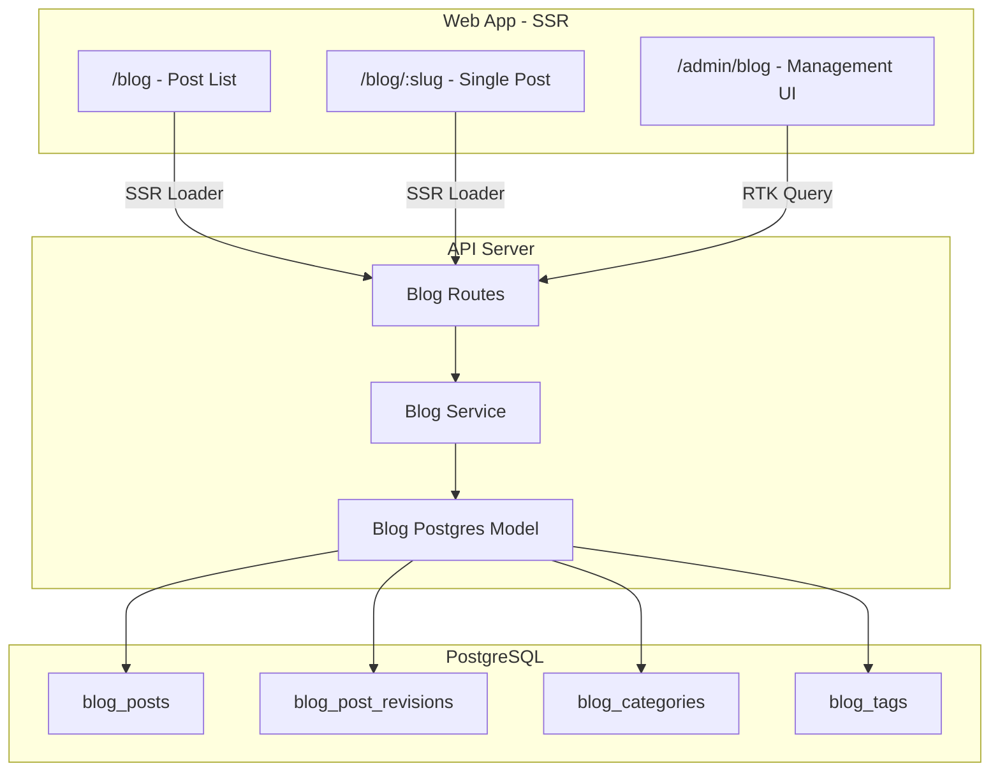

# Database-Driven Blog CMS Implementation Plan

## Overview

Implement a full-featured blog/news CMS with database-driven content, markdown rendering, role-based authorship (editor role), draft/scheduling/revision support, and an admin UI - all integrated with the existing SSR infrastructure.

## Requirements Summary

### Content & Structure
| Requirement | Decision |
|-------------|----------|
| Post slugs | Auto-generated from title with manual override |
| Categories | Flat (single-level, no hierarchy) |
| Tags | Flat (many-to-many with posts) |
| Featured images | Optional (not required for publishing) |
| Post excerpts | Auto-generated from first ~200 chars, with manual override |
| Reading time | Calculated and displayed |
| URL structure | `/blog/:slug` |

### Authorship & Permissions
| Requirement | Decision |
|-------------|----------|
| Role model | Single "editor" role with full blog access |
| Author attribution | Author's choice per post (show name or anonymous) |
| Anonymous display | Shows "DX3 Team" when anonymous |

### Revisions & Scheduling
| Requirement | Decision |
|-------------|----------|
| Revision retention | Unlimited (keep all history) |
| Scheduled posts | node-cron background job within API process |

### Public Display
| Requirement | Decision |
|-------------|----------|
| Pagination | Infinite scroll |
| Posts per load | 5 posts |
| Related posts | Yes, based on shared categories + tags |
| Comments | Deferred to future phase |

### Media & SEO
| Requirement | Decision |
|-------------|----------|
| Images in content | Both Media API (S3) and external URLs allowed |
| SEO fields | Title, description, canonical URL override |

## Completed Work

### Step 1: Publish/Schedule in List (Done)

**List view quick actions:**

- **Publish** – Publish immediately with confirmation dialog (Confirm/Cancel, Lottie animations).
- **Schedule** – Opens `BlogScheduleDialogComponent` with:
  - Date/time picker (min: now)
  - Timezone Autocomplete (curated list; "Your timezone" grouped first)
  - "In your timezone" preview when timezone differs from user's
  - Confirm/Cancel
- **Unschedule** – Reverts scheduled posts to draft with confirmation.

**List columns:**

- Title, Slug, Status (all existing)
- **Date** – Creation date (`createdAt`), sortable
- **Date Published** – `publishedAt` when published, `scheduledAt` when scheduled, em dash otherwise; sortable
- **Actions** – Publish, Schedule (draft only), Unschedule (scheduled only)

**API:**

- `POST /blog/admin/posts/:id/publish`
- `POST /blog/admin/posts/:id/schedule` (body: `{ scheduledAt: ISO string }`)
- `POST /blog/admin/posts/:id/unschedule`

**Components:**

- `BlogScheduleDialogComponent` – Modal for scheduling (extracted from list).
- `blog-admin-web-list.service.tsx` – List service with actions column.

### Step 2: Admin Settings Panel (Done)

**Post settings panel** – Right sidebar on edit post page (`/admin/blog/edit/:id`):

- **Slug** – Editable URL path (hidden on new post, auto-generated on first save).
- **Excerpt** – Optional multiline; API auto-generates if empty.
- **Categories** – Multi-select Autocomplete from `useGetBlogCategoriesQuery`.
- **Tags** – Multi-select Autocomplete with `freeSolo` (create-on-the-fly) from `useGetBlogTagsQuery`.
- **Anonymous toggle** – "Publish as DX3 Team (anonymous)".
- **SEO section** – `seoTitle`, `seoDescription`, `canonicalUrl`.

**Layout:** Flex row on desktop (editor ~66%, settings 320px sticky); column stack on mobile.

**State:** Redux `blogEditor.settings`; `editorFormLoad` and `settingsSet` actions.

**Components:**

- `BlogAdminSettingsComponent` – Settings form.
- `blog-admin-web.types.ts` – `BlogEditorSettingsType`.

**Note:** Scheduling remains in the list view (Schedule/Unschedule actions). Featured image deferred.

## Recommended Next Steps (Order)

| Step | Task | Rationale |
|------|------|-----------|
| 1 | ~~**Admin settings panel**~~ | Done. Slug, Excerpt, SEO section, categories/tags, anonymous toggle. |
| 2 | **Public SEO meta tags** | Render stored SEO fields in `<head>` on blog post pages (e.g. `<meta name="description">`, `og:title`). |
| 3 | Admin revisions UI | History list, diff view, restore. API exists. |
| 4 | RSS feed | Optional, can be last. |
| 5 | Tests | After core features are stable. |

**Note:** SEO meta tags are edited in the Admin settings panel, so the panel must be built first. Step 2 then adds the public-facing rendering of those values.

## Implementation Todos

| ID | Task | Status |
|----|------|--------|
| shared-types | Create shared blog types and constants in packages/shared/models/src/blog/ | Pending |
| db-models | Create Postgres models for blog_posts, revisions, categories, tags | Pending |
| db-migration | Create database migration script for blog tables | Pending |
| api-service | Implement BlogService with CRUD, publishing, scheduling, and revision methods | Pending |
| api-routes | Create public and admin API routes for blog operations | Pending |
| scheduler | Implement node-cron job for publishing scheduled posts | Pending |
| ssr-loaders | Add SSR loaders to ssr.routes.tsx for /blog and /blog/:slug | Pending |
| public-components | Refactor blog components with markdown rendering, infinite scroll, related posts | Pending |
| admin-routes | Add blog admin routes to admin.router.tsx | Pending |
| admin-ui | Build admin UI: post list, markdown editor, settings, revisions | Pending |
| rtk-api | Create RTK Query endpoints for blog admin operations | Pending |
| i18n | Add all blog-related i18n strings to en.json | Pending |

## Architecture Overview



## Phase 1: Shared Types and Constants

Create shared blog types in `packages/shared/models/src/blog/`:

- `blog-shared.types.ts` - BlogPost, BlogCategory, BlogTag, BlogRevision types
- `blog-shared.consts.ts` - Post status enum (DRAFT, SCHEDULED, PUBLISHED, ARCHIVED), role constants

Key types:

```typescript
type BlogPostStatus = 'draft' | 'published' | 'scheduled' | 'archived'

type BlogPostType = {
  authorId: string
  canonicalUrl: string | null        // SEO: canonical URL override
  categories: BlogCategoryType[]
  content: string                    // Markdown content
  createdAt: Date
  excerpt: string | null             // Manual excerpt (auto-generated if null)
  featuredImageId: string | null     // Optional featured image
  id: string
  isAnonymous: boolean               // Author's choice: show name or "DX3 Team"
  publishedAt: Date | null
  readingTimeMinutes: number         // Calculated from content length
  scheduledAt: Date | null
  seoDescription: string | null
  seoTitle: string | null
  slug: string                       // Auto-generated with manual override
  status: BlogPostStatus
  tags: BlogTagType[]
  title: string
  updatedAt: Date
}

type BlogCategoryType = {
  id: string
  name: string
  slug: string
}

type BlogTagType = {
  id: string
  name: string
  slug: string
}

type BlogPostRevisionType = {
  content: string
  createdAt: Date
  editorId: string                   // Who made this revision
  excerpt: string | null
  id: string
  postId: string
  title: string
}
```

## Phase 2: Database Layer (API)

### 2.1 Postgres Models

Create in `packages/api/libs/blog/`:

| Model | Table | Purpose |
|-------|-------|---------|
| `BlogPostModel` | `blog_posts` | Main posts table with status, scheduling, SEO fields |
| `BlogPostRevisionModel` | `blog_post_revisions` | Version history for each post |
| `BlogCategoryModel` | `blog_categories` | Post categories (hierarchical) |
| `BlogTagModel` | `blog_tags` | Post tags (flat) |
| `BlogPostTagModel` | `blog_post_tags` | Many-to-many junction |
| `BlogPostCategoryModel` | `blog_post_categories` | Many-to-many junction |

### 2.2 Migration Script

Create migration in `packages/api/libs/pg/migrations/scripts/`:

- `YYYYMMDDHHMMSS-create-blog-tables.js` - Creates all blog tables with indexes

### 2.3 Blog Service

Create `packages/api/libs/blog/blog-api.service.ts`:

**Public Methods:**
- `getPublishedPosts(cursor, limit)` - Cursor-based pagination for infinite scroll (5 posts default)
- `getPostBySlug(slug)` - Single post with author info for SSR
- `getRelatedPosts(postId, limit)` - Posts sharing categories/tags (exclude current)
- `getCategories()` - All categories
- `getTags()` - All tags

**Admin Methods:**
- `getAllPosts(filters, sort, cursor)` - All posts with status filter, sorted by createdAt desc
- `createPost(data, authorId)` - Create draft with auto-generated slug
- `updatePost(id, data, editorId)` - Update and create revision
- `deletePost(id)` - Soft delete
- `publishPost(id)` - Change status to published, set publishedAt
- `schedulePost(id, scheduledAt)` - Set status to scheduled
- `getRevisions(postId)` - Get revision history
- `restoreRevision(postId, revisionId, editorId)` - Restore from history (creates new revision)

**Utility Methods:**
- `generateSlug(title, existingSlug?)` - Create unique slug from title
- `calculateReadingTime(content)` - ~200 words per minute
- `generateExcerpt(content, maxLength)` - First ~200 chars if no manual excerpt

### 2.4 Scheduled Post Publisher

Create `packages/api/libs/blog/blog-scheduler.service.ts`:

- Uses `node-cron` to run every minute
- Queries posts where `status = 'scheduled'` AND `scheduledAt <= NOW()`
- Updates status to `published` and sets `publishedAt`
- Logs published posts for monitoring

## Phase 3: API Routes

Create in `packages/api/api-app/src/blog/`:

**Public Routes (SSR-compatible):**
| Endpoint | Method | Purpose |
|----------|--------|---------|
| `/api/blog/posts` | GET | List published posts (cursor pagination, 5 per page) |
| `/api/blog/posts/:slug` | GET | Single post by slug with author info |
| `/api/blog/posts/:id/related` | GET | Related posts by category/tag overlap |
| `/api/blog/categories` | GET | List all categories |
| `/api/blog/tags` | GET | List all tags |

**Admin Routes (Editor role required):**
| Endpoint | Method | Purpose |
|----------|--------|---------|
| `/api/blog/admin/posts` | GET | List all posts (filters, sorted by createdAt desc) |
| `/api/blog/admin/posts` | POST | Create new draft post |
| `/api/blog/admin/posts/:id` | GET | Get single post for editing |
| `/api/blog/admin/posts/:id` | PUT | Update post (creates revision) |
| `/api/blog/admin/posts/:id` | DELETE | Soft delete post |
| `/api/blog/admin/posts/:id/publish` | POST | Publish immediately |
| `/api/blog/admin/posts/:id/schedule` | POST | Schedule for future publish |
| `/api/blog/admin/posts/:id/revisions` | GET | Get revision history |
| `/api/blog/admin/posts/:id/revisions/:revisionId/restore` | POST | Restore from revision |
| `/api/blog/admin/categories` | GET/POST/PUT/DELETE | Category CRUD |
| `/api/blog/admin/tags` | GET/POST/PUT/DELETE | Tag CRUD |

Add `editor` to user roles in `packages/shared/models/src/user/user-shared.consts.ts`.

## Phase 4: Web App - Public Blog (SSR)

### 4.1 Update SSR Routes

Modify `packages/web/web-app/src/app/routers/ssr.routes.tsx`:

- Add SSR loader for `/blog` to fetch published posts
- Add SSR loader for `/blog/:slug` to fetch single post
- Add route for individual blog post pages

### 4.2 Refactor Blog Components

Update `packages/web/web-app/src/app/blog/`:

- `blog-web.component.tsx` - Blog list with infinite scroll (5 posts per load)
- `blog-post-web.component.tsx` - Single post view with:
  - Markdown-rendered content
  - Author name or "DX3 Team" based on `isAnonymous`
  - Reading time display
  - Related posts section (category + tag based)
- `blog-post-card.component.tsx` - Reusable card showing:
  - Featured image (if present)
  - Title, excerpt (auto or manual)
  - Author, date, reading time
  - Category/tag chips
- `blog-markdown-renderer.component.tsx` - Markdown to HTML with syntax highlighting
- `blog-infinite-scroll.hook.ts` - Custom hook for cursor-based infinite loading
- `blog-related-posts.component.tsx` - Related posts sidebar/section

### 4.3 Markdown Rendering

Install `react-markdown` and `remark-gfm` for markdown rendering with GitHub Flavored Markdown support. Use `rehype-highlight` for code syntax highlighting.

### 4.4 Infinite Scroll Implementation

Use Intersection Observer API to detect when user scrolls near bottom:
- Trigger fetch for next page using cursor from last post
- Show loading skeleton while fetching
- Stop when no more posts returned

## Phase 5: Web App - Admin UI (CSR)

### 5.1 Admin Routes

Add to `packages/web/web-app/src/app/routers/admin.router.tsx`:

- `/admin/blog` - Blog post management dashboard
- `/admin/blog/new` - Create new post
- `/admin/blog/edit/:id` - Edit existing post
- `/admin/blog/categories` - Category management
- `/admin/blog/tags` - Tag management

### 5.2 Admin Components

Create in `packages/web/web-app/src/app/blog/admin/`:

- `blog-admin-list.component.tsx` - DataGrid of all posts:
  - Columns: Title, Slug, Status, Date, Date Published, Actions
  - Filters: Status (draft/published/scheduled/archived)
  - Default sort: Most recently created
  - Quick actions: Edit, Publish, Schedule, Unschedule
- `blog-admin-editor.component.tsx` - Markdown editor (done)
- `blog-admin-settings.component.tsx` - Post settings panel (see Admin Settings Panel UI Plan below)
- `blog-admin-revisions.component.tsx` - Revision history (list of revisions, diff view, restore button)
- `blog-admin-revisions.component.tsx` - Revision history:
  - List of all revisions with timestamp and editor
  - Diff view comparing revisions
  - Restore button (creates new revision)

### 5.3 Markdown Editor

Use `@mdxeditor/editor` for the admin markdown editor with:

- WYSIWYG / Notion-like editing experience
- Toolbar for formatting (headings, lists, quotes, links)
- Plugins: headingsPlugin, listsPlugin, quotePlugin, thematicBreakPlugin, linkPlugin, linkDialogPlugin, markdownShortcutPlugin
- Image upload integration (via existing Media API) - to be added in follow-up

### 5.4 RTK Query API

Create `packages/web/web-app/src/app/blog/blog-web.api.ts`:

- Endpoints for all admin operations
- Cache invalidation on mutations
- Optimistic updates for status changes

## Phase 6: Redux State

Create `packages/web/web-app/src/app/blog/store/`:

- `blog-web.reducer.ts` - Blog admin state (current draft, filters)
- `blog-web.selectors.ts` - Memoized selectors

## Phase 7: i18n Strings

Update `packages/web/web-app/src/assets/locales/en.json` with all blog-related strings (titles, buttons, status labels, error messages).

## Key Files to Create/Modify

| File | Action | Description |
|------|--------|-------------|
| `packages/shared/models/src/blog/*` | Create | Shared types and constants |
| `packages/shared/models/src/user/user-shared.consts.ts` | Modify | Add 'editor' role |
| `packages/api/libs/blog/*` | Create | Models, service, scheduler |
| `packages/api/api-app/src/blog/*` | Create | Controller and route registration |
| `packages/api/api-app/src/data/pg/dx-postgres.models.ts` | Modify | Register blog models |
| `packages/api/api-app/src/routes/v1.routes.ts` | Modify | Add blog routes |
| `packages/api/api-app/src/main.ts` | Modify | Initialize blog scheduler |
| `packages/api/libs/pg/migrations/scripts/*` | Create | Blog tables migration |
| `packages/web/web-app/src/app/blog/*` | Modify/Create | Public and admin components |
| `packages/web/web-app/src/app/routers/ssr.routes.tsx` | Modify | Add SSR loaders for /blog and /blog/:slug |
| `packages/web/web-app/src/app/routers/admin.router.tsx` | Modify | Add admin routes |
| `packages/web/web-app/src/assets/locales/en.json` | Modify | Add blog i18n strings |

## Dependencies to Add

**API Package:**

- `node-cron` - Scheduled post publisher (runs every minute)

**Web Package:**

- `react-markdown` - Markdown rendering for public pages
- `remark-gfm` - GitHub Flavored Markdown support
- `rehype-highlight` - Code syntax highlighting
- `@mdxeditor/editor` - Admin WYSIWYG markdown editor
- `diff` - Revision diff display
- `react-intersection-observer` - Infinite scroll trigger

## Estimated Scope

This is a significant feature spanning ~30-40 files across shared, API, and web packages.

**Recommended Implementation Order:**

1. **Phase 1: Foundation** (shared types, DB models, migration)
2. **Phase 2: API Layer** (service, routes, scheduler)
3. **Phase 3: Public SSR** (blog list, single post, related posts, infinite scroll)
4. **Phase 4: Admin UI** (list, editor, settings, revisions)
5. **Phase 5: Polish** (i18n, error handling, loading states)

**Estimated Effort:** 3-5 days for full implementation

---

## Admin Settings Panel UI Plan

The Admin settings panel is where editors configure post metadata, taxonomy, and SEO. It should live on the **edit post page** (`/admin/blog/edit/:id`), alongside the title + markdown editor.

### Layout Options

| Option | Description | Recommendation |
|--------|-------------|----------------|
| **Right sidebar** | Collapsible drawer to the right of the editor | Best for desktop; keeps content and settings visible |
| **Below editor** | Expandable Accordion/Collapsible section | Works well on mobile; simpler layout |
| **Tabbed** | "Content" vs "Settings" tabs | Clear separation but requires tab switching |

**Recommended:** Right sidebar (desktop) that collapses to a bottom drawer or full-width accordion on mobile. Use MUI `Drawer` or a sticky `Paper` with `sx={{ position: 'sticky', top: ... }}`.

### Panel Sections (Top to Bottom)

**1. Slug**
- TextField, prefilled from `post.slug`
- Auto-generated on create from title; editable
- Show validation error if slug exists (API returns error on save)
- Helper text: "URL path (e.g. my-post-title)"

**2. Excerpt**
- Multiline TextField (2–3 rows)
- Optional; if empty, API auto-generates from content
- Helper text: "Brief summary for cards and SEO. Leave empty to auto-generate."

**3. Categories**
- Autocomplete multi-select
- Options from `useGetBlogCategoriesQuery()`
- Create new category inline (future: admin CRUD for categories)
- Selected: `post.categories` (array of `{ id, name, slug }`)

**4. Tags**
- Autocomplete multi-select with create-on-the-fly
- Options from `useGetBlogTagsQuery()`
- Allow free-text entry; API `resolveTagIds` finds or creates by slug
- Selected: `post.tags` (array of `{ id, name, slug }`)

**5. Featured Image** (Optional Phase)
- Media selector or URL input
- Maps to `featuredImageId`
- Can defer if Media API integration is nontrivial

**6. Anonymous Toggle**
- MUI Switch: "Publish as DX3 Team (anonymous)"
- Maps to `isAnonymous`

**7. SEO Section** ← **SEO meta tags live here**
- **SEO Title** (`seoTitle`) – TextField, placeholder: "Defaults to post title"
- **SEO Description** (`seoDescription`) – Multiline, max ~160 chars, placeholder: "Meta description for search results"
- **Canonical URL** (`canonicalUrl`) – TextField, optional, for cross-posting / syndication

These fields feed `<meta name="description">`, `<meta property="og:title">`, etc. on the public post page. The public `blog-post-web.component.tsx` must render these in `<head>` (via React Helmet or equivalent).

**8. Scheduling**
- Only shown when post is DRAFT
- Datetime-local + timezone (reuse `BlogScheduleDialogComponent` patterns or inline fields)
- Maps to `scheduledAt`; calls `schedulePost` API on "Schedule" or persists via `updatePost` if API supports `scheduledAt` in update payload
- If post is SCHEDULED: show scheduled date + "Change" / "Unschedule" actions

### Data Flow

- **Load:** `useGetBlogAdminPostByIdQuery(id)` populates post; settings panel reads `post.slug`, `post.excerpt`, `post.categories`, `post.tags`, `post.seoTitle`, `post.seoDescription`, `post.canonicalUrl`, `post.isAnonymous`, `post.scheduledAt`.
- **Save:** On "Save" (or auto-save), `updatePost` payload includes all changed settings. Editor already sends `content` and `title`; extend to include settings fields.
- **State:** Either lift settings into Redux (`blogEditor` reducer) or keep local state in the settings component and merge into payload on save.

### Implementation Order

1. Create `BlogAdminSettingsComponent` shell (empty panel, correct placement in editor layout).
2. Slug + Excerpt (simplest fields).
3. SEO section (seoTitle, seoDescription, canonicalUrl).
4. Categories + Tags (requires Autocomplete + API wiring).
5. Anonymous toggle.
6. Scheduling (inline or link to schedule flow).
7. Featured image (optional).
