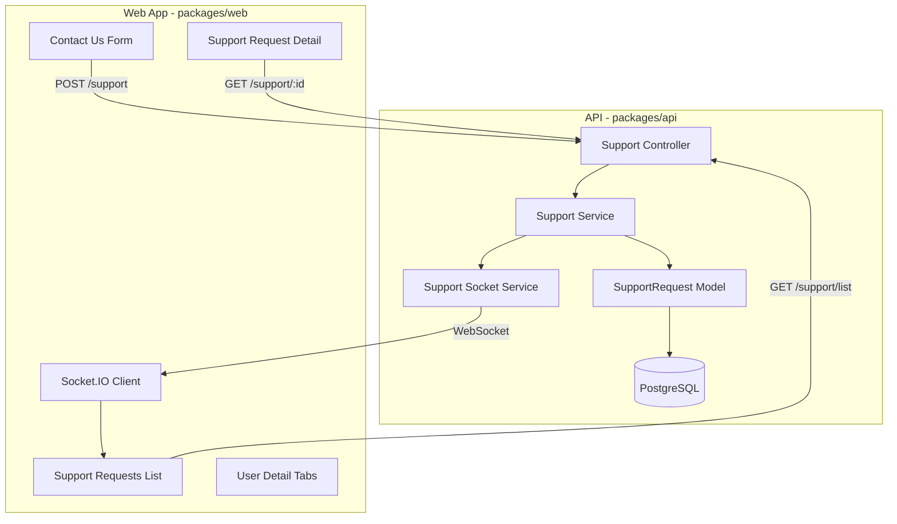

# Contact Us Support Feature Implementation Plan

## Overview

This plan implements a comprehensive support system enabling authenticated users to submit support requests, administrators to manage and respond to those requests, and real-time notifications for new submissions. The architecture is designed to support future threading/response functionality.

---

## Architecture Diagram

---

## Data Model

### SupportRequest Table

| Column | Type | Description |
|--------|------|-------------|
| id | UUID | Primary key |
| user_id | UUID | Foreign key to users table |
| category | ENUM | 'new_feature', 'issue', 'question', 'other' |
| subject | VARCHAR | Request subject line (255 char limit via validation) |
| message | TEXT | Request body (2000 char limit via validation) |
| status | ENUM | 'new', 'open', 'in_progress', 'resolved', 'closed' (default: 'new') |
| created_at | TIMESTAMP | Submission timestamp |
| updated_at | TIMESTAMP | Last update timestamp |
| resolved_at | TIMESTAMP | When marked resolved (nullable) |
| assigned_to | UUID | Admin user handling request (nullable, for future use) |
| viewed_by_admin | BOOLEAN | Whether an admin has viewed this request |
| viewed_at | TIMESTAMP | When first viewed by an admin (nullable) |

### SupportMessage Table (Thread Support - Future)

| Column | Type | Description |
|--------|------|-------------|
| id | UUID | Primary key |
| support_request_id | UUID | Foreign key to support_requests |
| user_id | UUID | Message author (user or admin) |
| message | TEXT | Response content |
| is_admin_response | BOOLEAN | Distinguishes admin vs user messages |
| is_internal_note | BOOLEAN | If true, only visible to admins (not the user) |
| created_at | TIMESTAMP | Message timestamp |

---

## Design Decisions

| Decision | Choice |
|----------|--------|
| Categories | New Feature, Issue, Question, Other (sufficient for now) |
| Status Values | new, open, in_progress, resolved, closed |
| Default Status | "new" (when request is first created) |
| Status Transitions | Admins can freely change between any status |
| Admin Assignment | Required before changing status to "in_progress" |
| Response Types | Both internal admin notes AND user-visible responses (future) |
| Email Notifications | None for now |
| User Info in Detail View | Link to navigate to user's admin detail page |
| Badge Count | Only new/unviewed requests since admin last viewed the list |
| User Request History | Submit only for now (future: message center in Support section) |
| Character Limits | 255 subject / 2000 message - enforced via client/server validation only |
| Admin List Default Sort | Unviewed first, then by date |
| User Detail Tab Filter | Toggle between all requests / open requests only |
| Toast Notification | Shows category and subject; dismiss action marks as viewed |
| Rate Limit Threshold | Max 3 open/new requests per 24 hours (database check) |
| Success Feedback | Show confirmation page with request details after submission |
| Admin List Pagination | Standard pagination (like user admin list) |
| Admin List Search | Search by subject and/or user |
| Status Indicators | Color-coded chips (new=blue, open=yellow, in_progress=orange, resolved=green, closed=gray) |
| Subject Display | Truncated with ellipsis (max 50 chars) in list view |
| Empty States | Illustrated empty state with message |
| Status Changes | No confirmation dialog, immediate save |
| Bulk Actions | Checkboxes with floating action bar when items selected |
| User Column Display | Username → Full name → Email (fallback chain) |
| Delete Capability | No delete option for requests |
| Mobile Responsiveness | Follow existing responsive patterns in the app |
| Keyboard Shortcuts | Standard tab navigation only |
| Table Component | Reuse existing `@dx3/web-libs/ui/table/table.component.tsx` |
| API Testing | All API code must be unit tested |
| Category Icons | No icons, text only with color chips |
| Timestamp Format | Relative time with absolute on hover |
| Socket Reconnection | Silent reconnect, fetch missed notifications |

---

## Implementation Phases

### Phase 1: Shared Models and Types

Create shared types in `packages/shared/models/src/support/`:
- `support-shared.types.ts` - SupportRequest, SupportMessage, SupportCategory, SupportStatus types
- `support-shared.consts.ts` - Category and status enums, socket namespace constant

### Phase 2: API Backend

**Database Layer** (`packages/api/libs/support/`):
- `support-api.postgres-model.ts` - Sequelize model for support_requests table
- `support-message-api.postgres-model.ts` - Sequelize model for support_messages table (scaffold for future)
- `support-api.service.ts` - Business logic for CRUD operations
- `support-api.socket.ts` - WebSocket service for admin notifications

**API Routes** (`packages/api/api-app/src/support/`):
- `support-api.controller.ts` - Request handlers
- `support-api.routes.ts` - Express route configuration

**Route Endpoints** (version specified in request header, not URL):
- `POST /support` - Create support request (authenticated users, rate limited)
- `GET /support/list` - List all requests (admin only, with sorting/filtering)
- `GET /support/:id` - Get single request detail (admin only)
- `GET /support/user/:userId` - Get requests by user (admin only)
- `GET /support/unviewed-count` - Get count of unviewed requests (admin only, for badge)
- `PUT /support/:id/status` - Update request status (admin only)
- `PUT /support/:id/viewed` - Mark request as viewed (admin only)
- `PUT /support/mark-all-viewed` - Mark all requests as viewed (admin only)
- `POST /support/:id/respond` - Add admin response (future)

**Rate Limiting** (on `POST /support`):
- Two-tier protection:
  1. `DxRateLimiters.veryStrict()` - 3 requests per 10 minutes per user
  2. Database check: If user has > 3 open/new requests in the last 24 hours, reject with 429
- Return user-friendly error message explaining the limit

**Request Validation** (client and server):
- Subject: required, max 255 characters
- Message: required, max 2000 characters
- Category: required, must be valid enum value

**Note**: No database migration required as the system is not yet deployed. Models will be created directly.

### Phase 3: WebSocket Integration

Extend the existing socket infrastructure in `packages/api/libs/socket-io-api/`:
- Create `support-api.socket.ts` for admin-only namespace
- Emit `newSupportRequest` event when request is created
- Namespace restricted to Admin and SuperAdmin roles only

### Phase 4: Frontend - Contact Us Form

**User-Facing Components** (`packages/web/web-app/src/app/support/`):
- `support-web.consts.ts` - Route constants
- `support-web.types.ts` - Component-specific types
- `contact-us-web.component.tsx` - Form with subject, message, and category dropdown
- `contact-us-web-success.component.tsx` - Confirmation page shown after successful submission
- `support-web.api.ts` - RTK Query endpoints
- `support-web.reducer.ts` - Redux state for support feature

**Form Fields**:
- Category (select): "New Feature", "Issue", "Question", "Other"
- Subject (text input, required, max 255 chars)
- Message (textarea, required, max 2000 chars)

**Success Confirmation Page**:
- Displays submitted request details (category, subject, message, timestamp)
- Shows confirmation message with request reference
- Button to submit another request or return to dashboard

### Phase 5: Frontend - Admin Support Management

**Admin Components** (`packages/web/web-app/src/app/support/admin/`):
- `support-admin-web.component.tsx` - Main admin wrapper
- `support-admin-web-list.component.tsx` - Sortable table of all requests
- `support-admin-web-detail.component.tsx` - Detail view with link to user's admin page and response capability
- `support-admin-web.consts.ts` - Admin route constants

**Detail View Features**:
- Display request subject, category, message, status, timestamps
- Link to navigate to the submitting user's admin detail page
- Status dropdown to change status (free transitions between any status)
- Assign to self/other admin (required before changing to "in_progress")
- Response area (future: internal notes and user-visible responses)

**Table Features** (reuse `@dx3/web-libs/ui/table/table.component.tsx`):
- Columns (in order): Date, Category, Subject, User, Status
- Date column: Relative time with absolute on hover (e.g., "2 hours ago" → "Jan 24, 2026 3:45 PM")
- Category column: Text only (no icons)
- Subject column: Truncated with ellipsis (max 50 chars)
- User column: Username → Full name → Email (fallback chain)
- Status column: Color-coded chips (new=blue, open=yellow, in_progress=orange, resolved=green, closed=gray)
- Default sort: Unviewed first, then by date (newest)
- Sortable by: date, category, subject, user, status
- Filterable by status and category
- Search by subject and/or user
- Standard pagination (uses existing TablePaginationActions)
- Checkbox column for bulk actions
- Floating action bar appears when items selected (mark viewed, close multiple)
- Row click navigates to detail view
- Viewing the list marks all visible requests as viewed
- Empty state: Illustrated empty state with "No support requests" message
- Follow existing responsive patterns for mobile

### Phase 6: Menu and Navigation Updates

**Support Menu for Authenticated Users**:
- Create `support.menu.ts` in `packages/web/web-app/src/app/ui/menus/`
- This is a unified (non-collapsible) menu group titled "Support"
- Contains two items:
  1. FAQ (moves from Public menu when authenticated)
  2. Contact Us (authenticated users only)

**Public Menu Modification**:
- Modify `public.menu.ts` to conditionally exclude FAQ when user is authenticated
- FAQ will appear under the Support menu instead for authenticated users

**Admin Menu Addition**:
- Add "Support Requests" menu item to `admin.menu.ts`
- Include badge support for unread request count

**Route Configuration**:
- Add support routes to `config-web.service.ts`
- Add lazy-loaded Contact Us route to `private.router.tsx`
- Add admin support routes to `admin.router.tsx`

### Phase 7: User Admin Detail Enhancement

Modify `user-admin-web-edit.component.tsx`:
- Keep all existing content as-is (no "Overview" tab)
- Add MUI Tabs component **below** the existing content
- Currently only one tab: "Support Requests"
- Support Requests tab displays that user's support requests with:
  - Filter toggle: "All Requests" / "Open Only" (new, open, in_progress)
  - Columns: Date, Category, Subject, Status (no User column needed)
  - Same styling: relative dates, color-coded status chips, truncated subjects
  - Click navigates to admin support detail view
  - Empty state: Illustrated empty state with "No support requests from this user"
- Architecture allows easy addition of future tabs

### Phase 8: Real-time Notifications

**Admin Socket Connection**:
- Create support socket client in `packages/web/web-app/src/app/data/socket-io/`
- Connect only for Admin/SuperAdmin users
- Display toast notification on new request showing category and subject
- Toast dismiss action calls API to mark request as viewed
- Update badge count on "Support Requests" menu item
- Silent reconnection on disconnect with automatic fetch of missed notifications

**Badge Implementation**:
- Add `badgeCount` property to `AppMenuItemType` in `app-menu.types.ts`
- Update menu rendering to show MUI Badge component
- Badge count = number of requests where `viewed_by_admin` is false
- When admin views the list, mark all visible requests as viewed
- Store unread count in Redux state

### Phase 9: i18n Strings

Add translation keys to `i18n.types.ts`:
- SUPPORT, SUPPORT_REQUESTS, CONTACT_US
- SUPPORT_CATEGORY_NEW_FEATURE, SUPPORT_CATEGORY_ISSUE, SUPPORT_CATEGORY_QUESTION, SUPPORT_CATEGORY_OTHER
- SUPPORT_STATUS_NEW, SUPPORT_STATUS_OPEN, SUPPORT_STATUS_IN_PROGRESS, SUPPORT_STATUS_RESOLVED, SUPPORT_STATUS_CLOSED
- SUPPORT_REQUEST_SUBMITTED, SUPPORT_REQUEST_UPDATED
- SUPPORT_SUBJECT, SUPPORT_MESSAGE, SUPPORT_SELECT_CATEGORY
- SUPPORT_RATE_LIMIT_EXCEEDED (user-friendly message for rate limit)
- SUPPORT_TOO_MANY_OPEN_REQUESTS (message when user has too many open requests)
- SUPPORT_NEW_REQUEST_TOAST (format: "New {category}: {subject}")
- SUPPORT_FILTER_ALL, SUPPORT_FILTER_OPEN_ONLY
- SUPPORT_ASSIGN_REQUIRED (message when trying to set in_progress without assignment)
- SUPPORT_REQUEST_SUBMITTED_SUCCESS (confirmation page title)
- SUPPORT_REQUEST_REFERENCE (reference number display)
- SUPPORT_SUBMIT_ANOTHER, SUPPORT_RETURN_TO_DASHBOARD
- SUPPORT_NO_REQUESTS (empty state message)
- SUPPORT_SEARCH_PLACEHOLDER (search input placeholder)
- SUPPORT_BULK_MARK_VIEWED, SUPPORT_BULK_CLOSE

---

## Key Files to Create

| File | Description |
|------|-------------|
| `packages/shared/models/src/support/support-shared.types.ts` | Shared type definitions |
| `packages/shared/models/src/support/support-shared.consts.ts` | Enums and constants |
| `packages/api/libs/support/support-api.postgres-model.ts` | SupportRequest Sequelize model |
| `packages/api/libs/support/support-message-api.postgres-model.ts` | SupportMessage model (future) |
| `packages/api/libs/support/support-api.service.ts` | Business logic |
| `packages/api/libs/support/support-api.socket.ts` | WebSocket service |
| `packages/api/api-app/src/support/support-api.controller.ts` | Request handlers |
| `packages/api/api-app/src/support/support-api.controller.spec.ts` | Controller unit tests |
| `packages/api/api-app/src/support/support-api.routes.ts` | Express routes |
| `packages/api/api-app/src/support/support-api.routes.spec.ts` | Routes unit tests |
| `packages/api/libs/support/support-api.service.spec.ts` | Service unit tests |
| `packages/api/libs/support/support-api.postgres-model.spec.ts` | Model unit tests |
| `packages/api/libs/support/support-api.socket.spec.ts` | Socket unit tests |
| `packages/web/web-app/src/app/support/support-web.consts.ts` | Route constants |
| `packages/web/web-app/src/app/support/contact-us-web.component.tsx` | Contact form |
| `packages/web/web-app/src/app/support/contact-us-web-success.component.tsx` | Success confirmation page |
| `packages/web/web-app/src/app/support/support-web.api.ts` | RTK Query endpoints |
| `packages/web/web-app/src/app/support/admin/support-admin-web-list.component.tsx` | Admin list view |
| `packages/web/web-app/src/app/support/admin/support-admin-web-detail.component.tsx` | Admin detail view |
| `packages/web/web-app/src/app/ui/menus/support.menu.ts` | Support menu config |

## Key Files to Modify

| File | Change |
|------|--------|
| `packages/api/api-app/src/routes/v1.routes.ts` | Add support routes |
| `packages/web/web-app/src/app/ui/menus/admin.menu.ts` | Add Support Requests menu item with badge |
| `packages/web/web-app/src/app/ui/menus/public.menu.ts` | Conditionally exclude FAQ when authenticated |
| `packages/web/web-app/src/app/ui/menus/menu-config.service.ts` | Include support menu for authenticated users |
| `packages/web/web-app/src/app/ui/menus/app-menu.types.ts` | Add badgeCount property |
| `packages/web/web-app/src/app/config/config-web.service.ts` | Add SUPPORT routes |
| `packages/web/web-app/src/app/routers/private.router.tsx` | Add Contact Us route |
| `packages/web/web-app/src/app/routers/admin.router.tsx` | Add admin support routes |
| `packages/web/web-app/src/app/user/admin/user-admin-web-edit.component.tsx` | Add tabs below existing content |
| `packages/shared/models/src/socket-io/socket-shared.types.ts` | Add support socket event types |
| `packages/web/web-app/src/app/i18n/i18n.types.ts` | Add support-related string keys |

---

## Implementation Status

All phases have been implemented. Below is the status of each task:

| Task | Status | Description |
|------|--------|-------------|
| shared-types | ✅ Complete | Created shared support types and constants in `packages/shared/models/src/support/` |
| api-model | ✅ Complete | Created Sequelize models for SupportRequest and SupportMessage |
| api-service | ✅ Complete | Created SupportService with CRUD operations and unit tests |
| api-socket | ✅ Complete | Created SupportSocketApiService for admin notifications |
| api-controller | ✅ Complete | Created SupportController, routes, and unit tests |
| web-contact-form | ✅ Complete | Created Contact Us form and success page with RTK Query API |
| web-admin-list | ✅ Complete | Created admin Support Requests list with sorting/filtering |
| web-admin-detail | ✅ Complete | Created admin Support Request detail view |
| web-user-tabs | ✅ Complete | Added tabs to user admin detail with Support Requests tab |
| menu-integration | ✅ Complete | Created Support menu, modified public menu, added badge to admin menu |
| socket-client | ✅ Complete | Created frontend socket client for real-time admin notifications |
| i18n-strings | ✅ Complete | Added all required i18n translation keys |

---

## Files Created/Modified

### Created Files

**Shared Models** (`packages/shared/models/src/support/`):
- `support-shared.consts.ts` - Category/status enums, validation limits, socket namespace
- `support-shared.types.ts` - Type definitions for support requests, messages, and socket events

**API Backend** (`packages/api/`):
- `libs/support/support-api.consts.ts` - Database table names
- `libs/support/support-api.postgres-model.ts` - SupportRequest Sequelize model
- `libs/support/support-message-api.postgres-model.ts` - SupportMessage model (future threading)
- `libs/support/support-api.service.ts` - Business logic for CRUD operations
- `libs/support/support-api.service.spec.ts` - Service unit tests
- `libs/support/support-api.socket.ts` - WebSocket service for admin notifications
- `api-app/src/support/support-api.controller.ts` - Request handlers
- `api-app/src/support/support-api.controller.spec.ts` - Controller unit tests
- `api-app/src/support/support-api.routes.ts` - Express route configuration
- `api-app/src/support/support-api.routes.spec.ts` - Routes unit tests

**Frontend** (`packages/web/web-app/src/app/support/`):
- `support-web.consts.ts` - Route constants
- `support-web.api.ts` - RTK Query endpoints
- `support-web.menu.ts` - Support menu configuration
- `support-web.sockets.ts` - WebSocket client for admin notifications
- `support-web.routes.tsx` - React Router route definitions
- `contact-us-web.component.tsx` - Contact Us form
- `contact-us-web-success.component.tsx` - Submission success page
- `store/support-web.reducer.ts` - Redux state management
- `store/support-web.selector.ts` - Redux selectors
- `admin/support-admin-list.component.tsx` - Admin list view with table
- `admin/support-admin-detail.component.tsx` - Admin detail view
- `admin/support-admin.routes.tsx` - Admin route definitions
- `admin/user-support-requests-tab.component.tsx` - User detail support tab

**Icons** (`packages/web/libs/ui/icons/`):
- Added `MAIL_OUTLINE` and `SUPPORT_AGENT` icons to `enums.ts` and `icons.tsx`

### Modified Files

- `packages/shared/models/src/index.ts` - Export support types
- `packages/api/api-app/src/routes/v1.routes.ts` - Add support routes
- `packages/web/web-app/src/app/i18n/i18n.types.ts` - Add support string keys
- `packages/web/web-app/src/app/i18n/i18n.consts.ts` - Add support string values
- `packages/web/web-app/src/app/ui/menus/admin.menu.ts` - Add Support Requests menu item
- `packages/web/web-app/src/app/ui/menus/public.menu.ts` - Add publicMenuAuthenticated (without FAQ)
- `packages/web/web-app/src/app/ui/menus/menu-config.service.ts` - Include support menu
- `packages/web/web-app/src/app/ui/menus/app-menu.types.ts` - Add badge properties
- `packages/web/web-app/src/app/ui/menus/app-menu-item.component.tsx` - Render badge count
- `packages/web/web-app/src/app/routers/private.router.tsx` - Add Contact Us routes
- `packages/web/web-app/src/app/routers/admin.router.tsx` - Add admin support routes
- `packages/web/web-app/src/app/user/admin/user-admin-web-edit.component.tsx` - Add tabs with Support Requests
- `packages/web/web-app/src/app/store/store-web.redux.ts` - Add support reducer
- `packages/web/web-app/src/app/config/bootstrap/login-bootstrap.ts` - Connect support socket for admins

---

## Testing Requirements

**API Unit Tests** (required):
- `support-api.service.spec.ts` - All service methods
- `support-api.controller.spec.ts` - All controller endpoints
- `support-api.routes.spec.ts` - Route configuration and middleware
- `support-api.postgres-model.spec.ts` - Model methods
- `support-api.socket.spec.ts` - Socket event emission

**Test Coverage**:
- CRUD operations for support requests
- Rate limiting behavior
- Database threshold check (>3 open requests)
- Role-based access control (admin-only endpoints)
- Validation (subject/message limits, required fields)
- Status transition logic (assignment required for in_progress)
- Bulk operations

**Frontend Tests** (follow existing patterns):
- Component tests for form validation
- RTK Query endpoint tests
