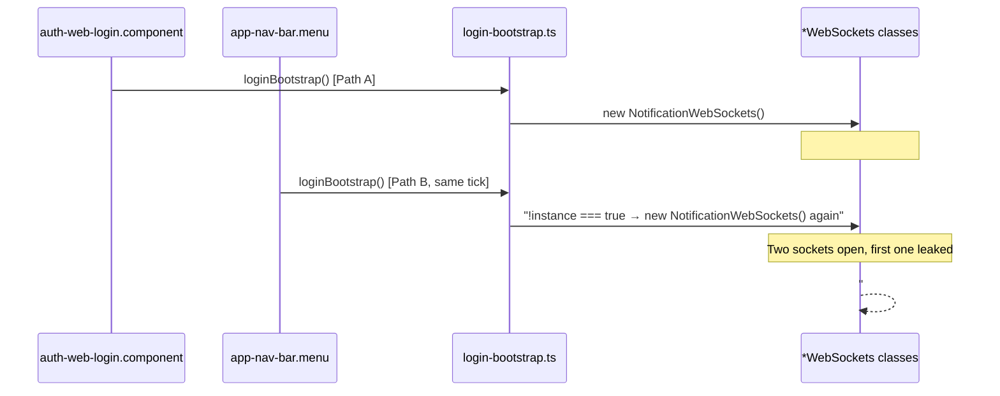

# Web Client Socket Bug Fixes

**Status: Implemented**

## Summary

Four bugs in the web client Socket.IO implementation were identified and fixed. The most severe caused a duplicate (leaked) socket connection to be created on every login. The remaining bugs left authenticated sockets open after logout and created stale singleton references.

---

## Root Cause Diagram



---

## Bug 1 (HIGH) — `#instance` race condition causes duplicate sockets on every login

### Root Cause

In all four socket classes, `#instance` was assigned inside `async setupSocket()` **after** the `await SocketWebConnection.createSocket()` call. The constructor fired `void this.setupSocket()` (fire-and-forget), so `#instance` remained `null` for the entire duration of the async gap. A second call to `connectToSockets()` during that gap passed the `!instance` guard and created a duplicate, leaked socket.

### Fix

Added a static synchronous `#initializing` boolean flag to all four classes. It is set to `true` in the constructor (before the `await`), cleared to `false` after `#instance` is assigned in `setupSocket()`, and also reset in `disconnect()`.

Updated the guard in `connectToSockets()` in [`login-bootstrap.ts`](../packages/web/web-app/src/app/config/bootstrap/login-bootstrap.ts) to check both conditions:

```typescript
if (!NotificationWebSockets.instance && !NotificationWebSockets.isInitializing) {
  new NotificationWebSockets()
}
```

**Files changed:**
- [`notification-web.sockets.ts`](../packages/web/web-app/src/app/notifications/notification-web.sockets.ts)
- [`feature-flag-web.sockets.ts`](../packages/web/web-app/src/app/feature-flags/feature-flag-web.sockets.ts)
- [`support-web.sockets.ts`](../packages/web/web-app/src/app/support/support-web.sockets.ts)
- [`admin-logs-web.sockets.ts`](../packages/web/web-app/src/app/admin-logs/admin-logs-web.sockets.ts)
- [`login-bootstrap.ts`](../packages/web/web-app/src/app/config/bootstrap/login-bootstrap.ts)

---

## Bug 2 (HIGH) — `loginBootstrap` called twice on every login and signup

### Root Cause

After a successful login or signup, two independent React effects both called `loginBootstrap()` in the same render commit:

- **Path A** — `auth-web-login.component.tsx` called `loginBootstrap(profile, mobileBreak)` inside the `loginResponse` effect
- **Path B** — `app-nav-bar.menu.tsx` called `loginBootstrap(userProfile, mobileBreak)` inside its `isAuthenticated && userProfile && !didCallBootstrap` effect, triggered by the same Redux dispatch from Path A

Both effects ran before any `await` inside `connectToSockets()` resolved, guaranteeing a duplicate socket was created on every login. The same problem existed in `auth-web-signup.component.tsx`.

### Fix

Removed `loginBootstrap(profile, mobileBreak)` from both `auth-web-login.component.tsx` and `auth-web-signup.component.tsx`. `AppNavBar` is the correct, single source of truth because it covers login, signup, and page-refresh (persisted session) in one place and already has the `didCallBootstrap` state guard.

Also removed the now-unused `mobileBreak` state and `windowWidth` selector from both components.

**Files changed:**
- [`auth-web-login.component.tsx`](../packages/web/web-app/src/app/auth/auth-web-login.component.tsx)
- [`auth-web-signup.component.tsx`](../packages/web/web-app/src/app/auth/auth-web-signup.component.tsx)

---

## Bug 3 (MEDIUM) — `NotificationWebSockets` and `SupportWebSockets` survived logout

### Root Cause

[`auth-web-logout.button.tsx`](../packages/web/web-app/src/app/auth/auth-web-logout.button.tsx) only disconnected `FeatureFlagWebSockets` and `AdminLogsWebSockets`. `NotificationWebSockets` had no `disconnect()` method at all. `SupportWebSockets.disconnect()` existed but was never called in the logout handler. Both sockets remained open and authenticated after logout, keeping the user's server-side room memberships alive until the browser session ended.

### Fix

Added a `disconnect()` method to `NotificationWebSockets` that nulls `this.socket`, `#instance`, and `#initializing` — consistent with the pattern in `AdminLogsWebSockets` and `SupportWebSockets`.

Updated the logout handler to call `.disconnect()` on all four sockets using optional chaining:

```typescript
NotificationWebSockets.instance?.disconnect()
FeatureFlagWebSockets.instance?.disconnect()
SupportWebSockets.instance?.disconnect()
AdminLogsWebSockets.instance?.disconnect()
```

**Files changed:**
- [`notification-web.sockets.ts`](../packages/web/web-app/src/app/notifications/notification-web.sockets.ts)
- [`auth-web-logout.button.tsx`](../packages/web/web-app/src/app/auth/auth-web-logout.button.tsx)

---

## Bug 4 (LOW) — `FeatureFlagWebSockets.disconnect()` left a stale `#instance`

### Root Cause

`FeatureFlagWebSockets.disconnect()` did not null `this.socket` or `#instance`. After logout, `FeatureFlagWebSockets.instance` remained non-null, causing the next login to take the `.connected` reconnect branch instead of creating a fresh authenticated connection.

### Fix

Updated `disconnect()` to null `this.socket`, `#instance`, and `#initializing`, consistent with the `AdminLogsWebSockets` pattern.

**File changed:**
- [`feature-flag-web.sockets.ts`](../packages/web/web-app/src/app/feature-flags/feature-flag-web.sockets.ts)

---

## Test Coverage

All five existing spec files were updated to cover the new behaviour:

| Spec file | New cases added |
|---|---|
| `notification-web.sockets.spec.ts` | `#initializing` lifecycle, `disconnect()` method, duplicate connection guard |
| `feature-flag-web.sockets.spec.ts` | `#initializing` lifecycle, fixed `disconnect()` nulling, duplicate guard |
| `support-web.sockets.spec.ts` | `#initializing` lifecycle, `static connect()` guard, duplicate guard |
| `admin-logs-web.sockets.spec.ts` | `#initializing` lifecycle, `static connect()` guard, `cleanup()` coverage |
| `login-bootstrap.spec.ts` | `isInitializing` guard prevents duplicate construction, reconnect path |

All 89 tests across 8 test suites pass with zero linter errors.
